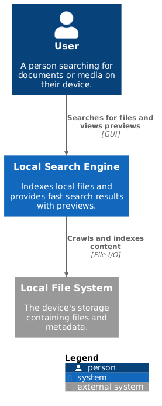
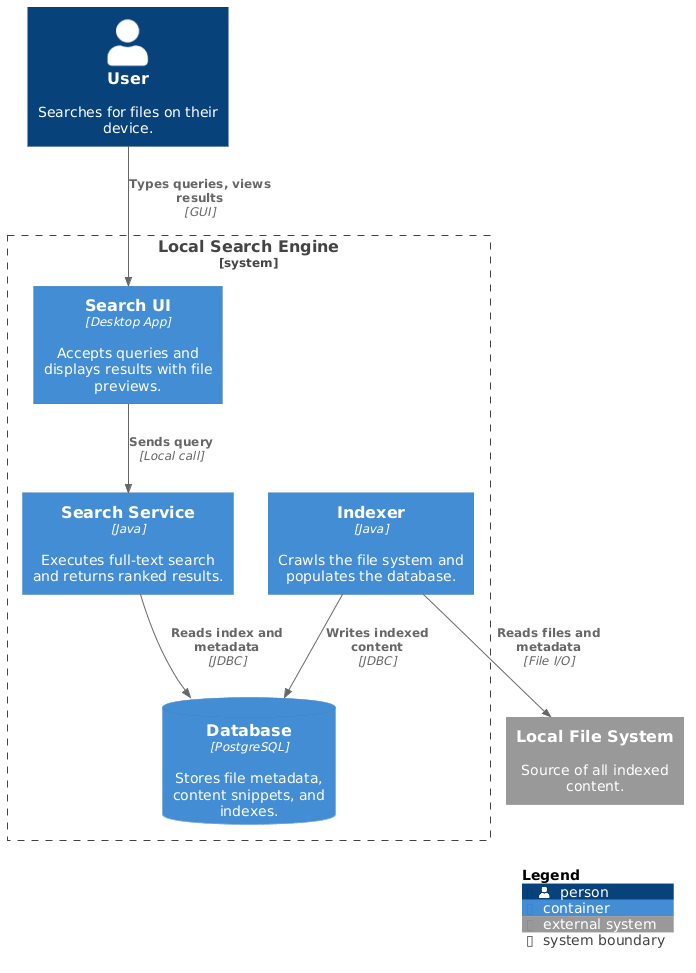
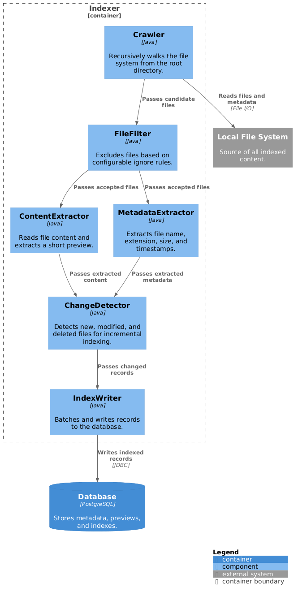
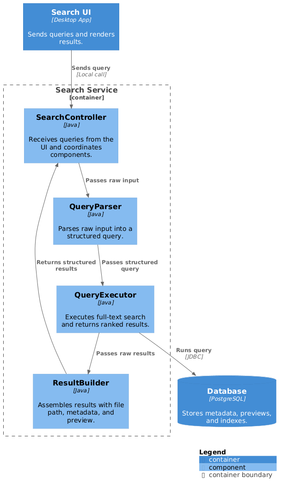

# Search Engine Architecture

## Overview
This is a local search engine application that allows users to look up documents and media from their local file system.  
The architecture description of the search engine covers four levels of abstraction: System context, Containers, Components, and Classes.

---

## Level 1 - System Context

> System Context Diagram: 

The search engine is a standalone local application that requires no network access and stores everything on the same device.
The user interacts with it through a graphical interface, and all indexed content comes from the local file system.

---

## Level 2 - Containers

> Containers Diagram: 

The system is composed of four containers:
1. **Search UI** - an interface where the user types queries and views results with file previews. Communicates with the Search Service over a local function call.
2. **Search Service** - a Java application that accepts queries, executes full-text search against the database, and returns ranked results with previews.
3. **Indexer** - a Java application that crawls the file system, extracts content and metadata, and populates the database. 
4. **Database** - a PostgreSQL instance that stores file metadata, content snippets, and full-text search indexes.

---

## Level 3 - Components

### Indexer

> Indexer Component Diagram: 

The Indexer runs on startup and incrementally on file changes. It walks the file system, processes each file, and writes records to the database.

**Crawler**  
Recursively traverses the file system from a root directory.  

**FileFilter**  
Applies configurable ignore rules to exclude unwanted files before any content is read.

**ContentExtractor**  
Reads file content and extracts a short preview.  

**MetadataExtractor**  
Extracts file metadata: name, extension, size, timestamps.  

**ChangeDetector**
Compares current file state against the stored index to determine whether a record needs to be inserted, updated, or skipped.

**IndexWriter**  
Batches processed file records and write them to the database.  

### Search Service

> Search Service Component Diagram: 

The Search Service receives queries from the UI, executes them against the database, and returns structured results.

**SearchController**
Receives incoming queries from the UI and coordinates the other components.

**QueryParser**  
Parses raw user input into a structured query object. 

**QueryExecutor**  
Builds and runs full-text search queries against the database.

**ResultBuilder**  
Assembles query results into structured records ready for the UI to display.  

### Search UI

The Search UI is the only container the user interacts with directly. It
sends queries to the Search Service and renders the results.

---

## Level 4 - Classes
